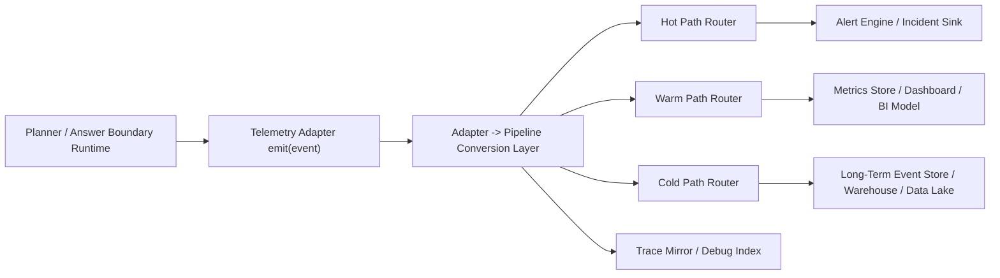

# Planner-Visible Production Telemetry Integration Blueprint

Back to [README.md](/Users/seanhan/Documents/Playground/README.md)

## Purpose

This document turns the checked-in planner-visible live telemetry stub into a production integration blueprint that infra and data teams can execute later without changing planner public contracts.

This blueprint is design-only:

- no external vendor is selected
- no external integration code is added in this thread
- no planner response shape changes
- no rollback automation is activated in this thread

It builds on the current checked-in local-only telemetry surface described in:

- [planner_visible_live_telemetry_design.md](/Users/seanhan/Documents/Playground/docs/system/planner_visible_live_telemetry_design.md)
- [planner_visible_multi_skill_observability.md](/Users/seanhan/Documents/Playground/docs/system/planner_visible_multi_skill_observability.md)
- [trace_log_spec.md](/Users/seanhan/Documents/Playground/docs/system/trace_log_spec.md)

## Current Code Truth

The current checked-in runtime already has these grounded pieces:

- planner-visible event schema and builder
  - `/Users/seanhan/Documents/Playground/src/planner-visible-live-telemetry-spec.mjs`
- adapter abstraction with injected sink selection
  - `/Users/seanhan/Documents/Playground/src/planner-visible-live-telemetry-adapter.mjs`
- runtime context propagation and event emission
  - `/Users/seanhan/Documents/Playground/src/planner-visible-live-telemetry-runtime.mjs`
- planner emission points for selection, fail-closed, ambiguity, and fallback
  - `/Users/seanhan/Documents/Playground/src/executive-planner.mjs`
- answer-boundary emission for final normalized user-visible output
  - `/Users/seanhan/Documents/Playground/src/user-response-normalizer.mjs`
- request-scoped local trace persistence for the shared runtime/tool logger
  - `/Users/seanhan/Documents/Playground/src/runtime-observability.mjs`
  - `/Users/seanhan/Documents/Playground/src/monitoring-store.mjs`

The current checked-in runtime does **not** yet do these things:

- no planner-visible event writes into `http_request_trace_events`
- no production telemetry backend
- no warehouse/dashboard materialization
- no alert delivery transport
- no feature-flag carrier for automated rollback
- no exact raw-wire request replay system

Current replay/debug truth is narrower:

- the repo supports request reconstruction from persisted trace events and request monitor rows
- the repo does not yet guarantee full-fidelity request replay from persisted input alone

## Non-Goals

This blueprint must not be interpreted as:

- a vendor choice
- approval to widen planner-visible admission
- approval to auto-roll back planner-visible by default
- evidence that company-brain write approval flow already exists

## Design Principles

1. Runtime emission stays fail-soft.
2. Planner execution must not block on external telemetry availability.
3. The checked-in event schema remains the source event contract.
4. Schema adaptation happens after the adapter boundary, not inside planner callsites.
5. Critical safety/control events stay full-fidelity.
6. Alerting starts manual-first and evidence-first.
7. Debuggability is request-scoped through `request_id` and `trace_id`.

## Recommended Integration Model

### Push vs Pull

Recommended model:

- runtime -> telemetry ingress: `push`
- warm/cold consumers -> stored telemetry: `pull` or warehouse query

Why:

- planner-visible events are emitted at request time inside planner and answer-boundary flow
- waiting for an external system to `pull` from runtime would couple planner latency to telemetry availability
- push keeps the current adapter abstraction intact and aligns with the existing `emit(event)` contract

Not recommended:

- direct production polling from planner runtime memory buffers
- runtime-time pull from external systems before request completion

### Synchronous vs Asynchronous

Recommended model:

- synchronous:
  - schema validation
  - event classification
  - bounded enqueue into a local in-process buffer or local durable spool
  - optional local trace mirror for critical events
- asynchronous:
  - network delivery to production telemetry infrastructure
  - batch materialization into warehouse/dashboard layers
  - alert fan-out transport

Why:

- this preserves planner runtime determinism
- failures in external telemetry delivery remain outside planner success criteria
- local bounded enqueue gives evidence that the runtime attempted telemetry emission

### Single Event vs Batch

Recommended model:

- hot path: single-event streaming for alert-eligible events
- warm path: micro-batch aggregation for dashboard/BI views
- cold path: append-only batch or streaming writes into long-term analytics storage

Practical rule:

- the source runtime always emits single events
- batching is introduced only after the adapter-to-pipeline conversion layer

## Target Architecture



## Adapter -> Pipeline Conversion Layer

This layer is the key production addition. It should sit **after** the checked-in telemetry adapter contract and **before** any vendor-specific ingestion.

Responsibilities:

- validate source event against the checked-in planner-visible event catalog
- add stable transport metadata without mutating source semantics
- classify each event into `log`, `event`, `metric`, and `trace_annotation`
- route the same source event to hot/warm/cold paths based on event type and severity
- control buffering, backpressure, retry, and drop policy

This layer must not:

- rewrite planner decisions
- infer a new routing result
- change `reason_code`, `routing_family`, or `selected_skill`
- drop critical control events silently

### Canonical Converted Envelope

The converted production envelope should wrap the checked-in event, not replace it.

```json
{
  "schema_version": "planner_visible_telemetry/v1",
  "source": {
    "system": "playground",
    "component": "planner_visible_runtime",
    "emitter": "planner-visible-live-telemetry-runtime",
    "event_type": "planner_visible_fail_closed"
  },
  "correlation": {
    "request_id": "string",
    "trace_id": "string|null"
  },
  "classification": {
    "record_kind": "event",
    "delivery_tier": "hot|warm|cold|multi",
    "severity": "info|warning|high|critical"
  },
  "dimensions": {
    "query_type": "search|detail|mixed|follow-up",
    "selected_skill": "string|null",
    "routing_family": "string",
    "reason_code": "string|null",
    "task_type": "string|null",
    "traffic_source": "real|test|replay|null",
    "request_backed": "boolean|null"
  },
  "measures": {
    "event_count": 1,
    "source_count": "number|null",
    "limitation_count": "number|null"
  },
  "event": {
    "raw": {}
  }
}
```

Recommended rule:

- `event.raw` preserves the original checked-in event shape exactly
- `dimensions` and `measures` are flattened derivatives for external systems that prefer indexed fields

## Sink Tiering

### Hot Path

Purpose:

- immediate safety and operational alerting

Recommended payload:

- full-fidelity raw event for alert-eligible event types
- alert summaries derived from the same event stream

Recommended event families:

- `planner_visible_fail_closed`
- `planner_visible_ambiguity`
- `planner_visible_answer_generated` when `answer_consistency_proxy_ok = false`
- selector-overlap or contract-violation signals if later emitted into the same family
- runtime delivery failure alerts from the conversion layer itself

Recommended retention:

- short retention
- indexed for recent incidents and on-call use

### Warm Path

Purpose:

- dashboards
- product monitoring
- BI trend analysis

Recommended contents:

- full event stream during shadow/baseline phase
- aggregated counters and ratios by hour/day after baseline stabilizes
- dimensions:
  - `query_type`
  - `selected_skill`
  - `routing_family`
  - `reason_code`
  - `task_type`
  - `traffic_source`

Recommended metrics:

- monitored request count
- per-skill hit rate
- fail-closed rate
- ambiguity rate
- fallback distribution
- answer inconsistency rate
- telemetry delivery failure rate

### Cold Path

Purpose:

- long-term analysis
- schema evolution audits
- retro investigations
- offline replay-bundle generation

Recommended contents:

- append-only raw event records
- versioned converted envelope
- derived daily aggregates

Recommended retention:

- much longer than hot/warm
- optimized for cost and historical completeness rather than instant querying

## Routing Matrix

| Event family | Hot | Warm | Cold | Notes |
| --- | --- | --- | --- | --- |
| `planner_visible_skill_selected` | no | yes | conditional | low urgency but needed for denominator and selection analysis |
| `planner_visible_fail_closed` | yes | yes | yes | full-fidelity control event |
| `planner_visible_ambiguity` | yes | yes | yes | full-fidelity control event |
| `planner_visible_fallback` | conditional | yes | yes | hot only when fallback source or family is anomalous |
| `planner_visible_answer_generated` | conditional | yes | yes | hot only when answer boundary or consistency proxy fails |

## Event Volume Control

### Sampling

Recommended policy:

- no sampling for critical control events
- sampling is allowed only for low-risk steady-state success events, and only after real baseline data exists

Must remain full-fidelity:

- `planner_visible_fail_closed`
- `planner_visible_ambiguity`
- `planner_visible_answer_generated` where any one of:
  - `answer_pipeline_enforced != true`
  - `raw_payload_blocked != true`
  - `answer_contract_ok != true`
  - `answer_consistency_proxy_ok != true`
- any future contract-violation event
- any delivery-failure event emitted by the telemetry pipeline itself

Recommended initial rollout:

- phase 1:
  - 100% of all planner-visible events into warm and cold paths
- phase 2:
  - keep the full-fidelity set above at 100%
  - optionally sample `planner_visible_skill_selected` and healthy `planner_visible_answer_generated` only in cold storage
  - warm-path metrics remain unsampled through pre-aggregation

### Aggregation

Recommended hourly and daily aggregates:

- monitored request count
- selected skill count by skill
- fail-closed count by query type
- ambiguity count by query type
- fallback count by routing family
- answer inconsistency count
- delivery failure count

Aggregation boundary:

- aggregation must never be the only surviving record for fail-closed or ambiguity incidents
- raw event retention remains required for incident investigation

## Alert Operationalization

### Alert Conditions -> Monitoring System

The alert engine should be fed from the hot path stream and evaluate the checked-in alert policy plus pipeline-health alerts.

Required production alert families:

- selector overlap detected
- fail-closed rate anomalous
- ambiguity rate spike
- fallback distribution anomalous
- answer mismatch detected
- telemetry delivery degraded
- telemetry delivery halted

### Ownership

Recommended owner mapping:

- engineering on-call
  - selector overlap
  - answer mismatch
  - raw payload exposure risk
  - telemetry delivery halted
- infra/data on-call or service owner
  - ingestion lag
  - pipeline delivery failure
  - warm/cold materialization gaps
- product owner
  - fail-closed drift
  - ambiguity drift
  - fallback distribution shifts
  - dashboard KPI interpretation

Recommended paging policy:

- page immediately:
  - selector overlap
  - answer mismatch / answer pipeline bypass
  - telemetry pipeline halted for critical events
- page during working hours or route to ticket:
  - fail-closed rate drift
  - ambiguity drift
  - fallback skew
  - cost/volume anomalies

### Automatic Rollback

Current repo truth:

- there is no checked-in feature-flag carrier for planner-visible rollback automation

Recommended production policy for the first live phase:

- no automatic rollback
- alert -> human review -> manual planner-visible disable or admission tightening

Reserved future eligibility only:

- selector overlap
- confirmed raw payload exposure
- repeated answer mismatch beyond critical threshold

Even for those categories, auto rollback should be enabled only when all of these are true:

- a real rollback flag carrier exists
- flag propagation latency is known
- rollback decision is independently verified
- false-positive rate is acceptable on live traffic

## Trace Integration

### Correlation Model

Recommended correlation keys:

- `request_id`
  - primary request/debug lookup key
  - stable join key across logs, events, and replay bundles
- `trace_id`
  - tracing-system correlation key
  - joins planner-visible telemetry with the broader runtime trace

Recommended trace mapping:

- every planner-visible event attaches `trace_id` when available
- the external tracing system stores planner-visible events as span annotations, events, or correlated logs under the same trace
- warm/cold analytical stores keep both `request_id` and `trace_id`

### Support Debug

Production debug procedure should answer:

1. was the request evaluated for planner-visible admission
2. which skills were candidates
3. why was a skill selected or rejected
4. which fallback family ran
5. did the final answer stay inside the answer boundary

Minimum external lookup fields:

- `request_id`
- `trace_id`
- `query_type`
- `candidate_skills`
- `selected_skill`
- `routing_family`
- `reason_code`
- `decision_reason`

### Single Request Replay

Current code truth limits this design:

- existing persisted request input is sanitized debug input, not exact raw-wire replay material

Recommended production-compatible target is therefore a **bounded replay bundle**, not a promise of exact replay.

The replay bundle should contain:

- sanitized request envelope
- planner-visible telemetry timeline
- selected action/routing summary
- normalized answer-boundary result
- software version/build identifier
- traffic source

This supports:

- deterministic re-analysis of planner-visible selection/admission/fallback behavior
- comparison between original and replayed answer-boundary outcome

This does not yet guarantee:

- exact reconstruction of all external dependencies
- exact user payload reproduction
- replay of write-side or approval-side behavior

## Adapter -> External Mapping

### JSON Schema -> External System Schema

Recommended translation rule:

- preserve the checked-in planner-visible event JSON as the canonical source payload
- derive external indexed fields from the canonical payload
- do not invent external-only semantic fields that contradict the canonical payload

Suggested mapping layers:

- canonical source payload
  - exact event JSON from runtime
- transport envelope
  - schema version, environment, service, build id, ingestion timestamp
- indexed dimensions
  - correlation ids, query/routing/skill fields, severity, traffic source
- derived measures
  - counters and numeric fields for aggregation

### Log vs Event vs Metric

One source event can legitimately fan out into three external representations:

| Source event | Log/Event record | Metric effect | Trace effect |
| --- | --- | --- | --- |
| `planner_visible_skill_selected` | yes | increment monitored request + selected skill counters | annotate trace |
| `planner_visible_fail_closed` | yes | increment fail-closed counters | annotate trace |
| `planner_visible_ambiguity` | yes | increment ambiguity counters | annotate trace |
| `planner_visible_fallback` | yes | increment fallback counters by family | annotate trace |
| `planner_visible_answer_generated` | yes | increment answer counters and mismatch counters | annotate trace |

Recommended rule:

- raw event/log representation is the source of truth for incident explanation
- metrics are secondary derived views
- traces are correlation scaffolding, not the long-term analytical store

## Failure Modes And Degradation Policy

### External Telemetry Backend Unavailable

Required behavior:

- planner runtime continues
- conversion layer records delivery failure locally if possible
- hot-path critical events try local durable retention before drop

Recommended priority order:

1. preserve planner runtime
2. preserve critical control events
3. preserve local evidence of telemetry degradation
4. drop or sample low-priority success events first

### Queue / Buffer Pressure

Recommended drop order:

1. never drop critical fail-closed / ambiguity / answer-mismatch events intentionally
2. shed healthy `skill_selected` and healthy `answer_generated` cold-path copies first
3. emit telemetry-degraded alert when pressure crosses threshold

### Schema Drift

Recommended behavior:

- reject malformed converted envelopes at the conversion layer
- emit a local pipeline error event with the offending event family and schema version
- do not mutate malformed events into a different semantic meaning

### Duplicate Delivery

Recommended behavior:

- treat delivery as at-least-once
- deduplicate analytically by a stable event id derived from:
  - `request_id`
  - `event_type`
  - `timestamp`
  - optional sequence number if later added

### Local Trace Store vs External Store Divergence

Recommended interpretation:

- local trace store remains the nearest runtime evidence for request reconstruction
- warm/cold stores are analytical copies
- divergence is a telemetry pipeline incident, not planner proof of completion

## Estimated Volume And Cost Envelope

These numbers are design estimates inferred from the current checked-in event model, not observed production traffic.

### Event Count Per Monitored Request

Current runtime emission pattern implies:

- successful planner-visible request:
  - usually `2` events
  - `planner_visible_skill_selected`
  - `planner_visible_answer_generated`
- fail-closed non-ambiguous request:
  - usually `3` events
  - `planner_visible_fail_closed`
  - `planner_visible_fallback`
  - `planner_visible_answer_generated`
- fail-closed ambiguous request:
  - usually `4` events
  - `planner_visible_fail_closed`
  - `planner_visible_ambiguity`
  - `planner_visible_fallback`
  - `planner_visible_answer_generated`

Using the current checked-in fixture baseline as a rough shape:

- success share: `0.5`
- fail-closed share: `0.5`
- ambiguity share: `0.25`
- implied average events per monitored request: about `2.75`

This baseline is fixture-shaped and must be re-baselined after shadow traffic exists.

### Daily Event Estimate Table

| Monitored requests/day | Event range/day | Fixture-shaped estimate/day |
| --- | --- | --- |
| 10,000 | 20,000 - 40,000 | about 27,500 |
| 100,000 | 200,000 - 400,000 | about 275,000 |
| 1,000,000 | 2,000,000 - 4,000,000 | about 2,750,000 |

### Payload Volume Estimate

If one converted raw event averages about `1.2 KB - 2.0 KB` after envelope and indexing overhead:

- `100,000` monitored requests/day
  - about `330 MB - 550 MB/day` raw telemetry payload
- `1,000,000` monitored requests/day
  - about `3.3 GB - 5.5 GB/day` raw telemetry payload

Practical cost notes:

- hot-path costs are driven more by indexing and alert retention than by raw storage volume
- warm-path costs are dominated by high-cardinality indexed dimensions if `request_id` is indexed too broadly
- cold-path costs are dominated by raw retention duration and warehouse scan volume

## Rollout Sequence

Recommended order:

1. keep the checked-in source event schema unchanged
2. add the adapter -> pipeline conversion layer
3. mirror planner-visible events into a trace/debug index keyed by `trace_id`
4. route the same canonical event into hot/warm/cold sinks
5. materialize dashboards and alert rules from warm/hot paths
6. re-baseline thresholds from shadow/live evidence
7. consider sampling only after baseline stabilizes
8. consider guarded rollback automation only after manual-first operations are stable

## Handoff Checklist For Infra / Data Team

- ingest the five checked-in planner-visible event families without changing their semantics
- implement the conversion layer as the only vendor-specific boundary
- preserve both `request_id` and `trace_id` in every external representation
- make hot/warm/cold routing configurable by event family
- keep fail-closed, ambiguity, and answer-mismatch events full-fidelity
- expose hourly/daily aggregates for the existing alert policy
- support request-scoped lookup by `request_id` and `trace_id`
- treat replay as bounded reconstruction unless a later explicit replay-capture design lands

## Current Assessment

The repo is already ready for a production telemetry integration design because the planner-visible runtime has:

- a stable source event family
- an adapter abstraction
- request and trace correlation
- local debug reconstruction primitives

The repo is not yet ready to claim live production telemetry because:

- no external sink exists
- no planner-visible trace mirroring exists yet
- no feature-flag rollback carrier exists yet
- replay is still bounded reconstruction, not exact raw replay
