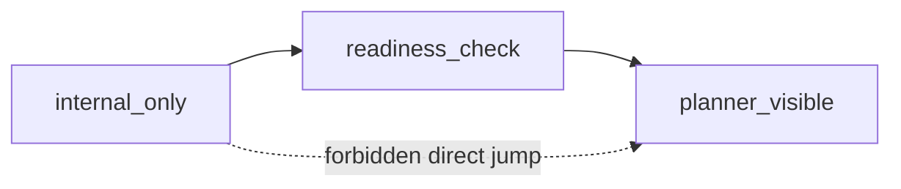

# Planner-Visible Skill Readiness

Back to [README.md](/Users/seanhan/Documents/Playground/README.md)

## Purpose

This document defines the fail-closed readiness gate for promoting a checked-in skill-backed planner action from `internal_only` to `planner_visible`.

Current code anchors:

- `/Users/seanhan/Documents/Playground/src/planner/skill-bridge.mjs`
- `/Users/seanhan/Documents/Playground/src/skill-governance.mjs`
- `/Users/seanhan/Documents/Playground/src/executive-planner.mjs`
- `/Users/seanhan/Documents/Playground/src/user-response-normalizer.mjs`
- `/Users/seanhan/Documents/Playground/tests/skill-runtime.test.mjs`
- `/Users/seanhan/Documents/Playground/tests/executive-planner.test.mjs`
- `/Users/seanhan/Documents/Playground/tests/user-response-normalizer.test.mjs`

Related mirrors:

- `/Users/seanhan/Documents/Playground/docs/system/skill_surface_policy.md`
- `/Users/seanhan/Documents/Playground/docs/system/skill_governance.md`
- `/Users/seanhan/Documents/Playground/docs/system/skill_spec.md`

## Frozen Baseline

Current checked-in baseline remains unchanged:

- freeze stays at `planner-visible-skill-readiness-v1 + latest main`
- all checked-in skills remain `internal_only`
- skill chaining remains disabled
- no checked-in skill is promoted to `planner_visible` in this thread
- `document_summarize` now records a completed `readiness_check` while remaining `internal_only`
- this change does not expand the planner-visible runtime surface

## Readiness Gate

A skill-backed planner action may be considered for `planner_visible` only when all of the following are true:

- selector remains deterministic and conflict-free
- regression gate is fully green
- the existing answer pipeline cannot be bypassed
- raw skill output is never exposed directly to the user
- the skill remains strictly `read_only`
- runtime access remains strictly `read_runtime`
- declared side effects stay within the existing read-only boundary
- output shape is stable and already normalized into the current `answer -> sources -> limitations` surface

Fail-closed meaning:

- if any one gate is missing, false, drifting, or unverifiable, promotion does not happen
- no heuristic downgrade, fallback promotion, or partial visibility is allowed

## Readiness Checklist

Use this checklist during `readiness_check` and keep evidence in the same change:

- deterministic selector key is unique against every checked-in deterministic skill
- deterministic selector task types do not overlap with any checked-in deterministic skill
- `selector_mode = deterministic_only`
- `skill_class = read_only`
- `runtime_access = ["read_runtime"]`
- declared write side effects are empty
- planner-visible candidate has passed `readiness_check`; direct jump from `internal_only` is forbidden
- regression pack is green, including skill runtime, planner contract/selector, answer normalization, and existing route regressions
- successful skill replies still pass through `/Users/seanhan/Documents/Playground/src/user-response-normalizer.mjs`
- canonical sources still pass through `/Users/seanhan/Documents/Playground/src/answer-source-mapper.mjs`
- raw fields such as `bridge`, `side_effects`, selector metadata, and trace-only fields are not rendered to the user
- output schema is stable and matches the checked-in planner contract output shape
- side effects are still bounded to the same read-only runtime surface and authority family

## Promotion Flow

Direct promotion is forbidden. The only valid path is:

Stage meaning:

- `internal_only`
  - deterministic planner-only access
  - hidden from strict planner `target_catalog`
- `readiness_check`
  - still not planner-visible
  - used to prove selector uniqueness, regression pass, answer-boundary safety, and stable output/side-effect shape
- `planner_visible`
  - still must remain read-only and stay behind `planner/skill-bridge.mjs`
  - still must use the existing answer pipeline and canonical source mapping

## Fail-Close Rules

Any one of the following blocks promotion:

- selector drift
  - duplicate selector key
  - overlapping deterministic selector task types
  - non-deterministic selector mode
- surface mixing
  - `planner_visible` without a prior `readiness_check`
  - `planner_visible` stage metadata mixed with `internal_only` surface
  - direct jump from `internal_only` to `planner_visible`
- output shape instability
  - output contract is not stable
  - user-facing rendering would require a new raw skill payload shape
  - answer normalization is not already proven
- side-effect boundary overreach
  - any declared write side effect
  - any `mutation_runtime` access
  - any side effect that would escape the current read-only authority boundary

## Upgradeable vs Not Upgradeable

May be considered in future:

- checked-in `read_only` skill-backed planner action
- deterministic selector with unique selector key and non-overlapping selector task types
- output already normalized into the current answer boundary
- no write path and no mutation runtime dependency

Must not be promoted:

- any `write` skill
- any `hybrid` skill
- any skill with raw output rendered directly to the user
- any skill that can bypass `user-response-normalizer.mjs`
- any skill whose output shape is still drifting
- any skill with selector conflict or ambiguous deterministic selection
- any skill that needs a new answer surface or new public API shape

## Current Checked-In Assessment

Current checked-in skill-backed actions:

- `search_and_summarize`
- `document_summarize`

Current status:

- both remain `internal_only`
- `search_and_summarize` remains `promotion_stage=internal_only`
- `document_summarize` is now checked in as:
  - `surface_layer=internal_only`
  - `promotion_stage=readiness_check`
  - `previous_promotion_stage=internal_only`
  - full readiness gate marked true for regression, answer pipeline, raw-output blocking, output stability, and side-effect boundary lock
- neither is promoted to `planner_visible` in this thread
- neither is allowed to enter strict planner `target_catalog`

First upgrade candidate:

- yes, a first candidate exists conceptually: `document_summarize`
- reason:
  - narrowest read-only surface
  - single-document input shape is simpler than open search query shape
  - deterministic selector is already isolated to `taskType=document_summary_skill`
  - answer/source rendering already maps cleanly into the existing user boundary
- current conclusion:
  - `document_summarize` is now the first checked-in `readiness_check` candidate
  - it is still not promoted to `planner_visible`
  - any future formal promotion must remain a dedicated follow-up change and must keep strict planner catalog admission fail-closed until that promotion lands

Second candidate, but not first:

- `search_and_summarize`
- broader query surface means more selector/query regression risk than `document_summarize`
