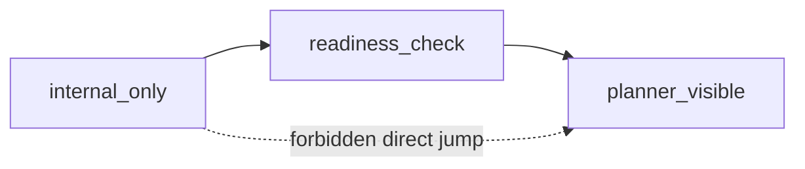

# Planner-Visible Skill Readiness

Back to [README.md](/Users/seanhan/Documents/Playground/README.md)

## Purpose

This document defines the fail-closed readiness gate for promoting a checked-in skill-backed planner action from `internal_only` to `planner_visible`.

Current code anchors:

- `/Users/seanhan/Documents/Playground/src/planner/skill-bridge.mjs`
- `/Users/seanhan/Documents/Playground/src/skill-governance.mjs`
- `/Users/seanhan/Documents/Playground/src/executive-planner.mjs`
- `/Users/seanhan/Documents/Playground/src/planner-visible-skill-observability.mjs`
- `/Users/seanhan/Documents/Playground/src/user-response-normalizer.mjs`
- `/Users/seanhan/Documents/Playground/scripts/planner-visible-skill-check.mjs`
- `/Users/seanhan/Documents/Playground/tests/skill-runtime.test.mjs`
- `/Users/seanhan/Documents/Playground/tests/executive-planner.test.mjs`
- `/Users/seanhan/Documents/Playground/tests/planner-visible-skill-observability.test.mjs`
- `/Users/seanhan/Documents/Playground/tests/search-and-summarize-readiness.test.mjs`
- `/Users/seanhan/Documents/Playground/tests/user-response-normalizer.test.mjs`

Related mirrors:

- `/Users/seanhan/Documents/Playground/docs/system/skill_surface_policy.md`
- `/Users/seanhan/Documents/Playground/docs/system/skill_governance.md`
- `/Users/seanhan/Documents/Playground/docs/system/skill_spec.md`

## Frozen Baseline

Current checked-in baseline for this promotion thread is:

- freeze starts from `document-summarize-readiness-check-v1`
- `search_and_summarize` remains `internal_only`
- skill chaining remains disabled
- `document_summarize` is the only checked-in skill promoted to `planner_visible`
- no third skill is added
- this change expands planner-visible runtime surface only for `document_summarize`

## Readiness Gate

A skill-backed planner action may be considered for `planner_visible` only when all of the following are true:

- selector remains deterministic and conflict-free
- regression gate is fully green
- the existing answer pipeline cannot be bypassed
- raw skill output is never exposed directly to the user
- the skill remains strictly `read_only`
- runtime access remains strictly `read_runtime`
- declared side effects stay within the existing read-only boundary
- output shape is stable and already normalized into the current `answer -> sources -> limitations` surface

Fail-closed meaning:

- if any one gate is missing, false, drifting, or unverifiable, promotion does not happen
- no heuristic downgrade, fallback promotion, or partial visibility is allowed

## Runtime Observability And Regression Watch

Current checked-in runtime now adds a minimal observability watch for the promoted `document_summarize` path without changing any public API:

- selector/runtime logs now expose whether a deterministic skill selector was attempted, which selector key was hit, whether selection fail-closed, and whether the chosen skill is `planner_visible` or `internal_only`
- skill-backed `tool_execution` logs now carry the skill surface layer, promotion stage, selector key, and whether the execution ended in `fail_closed`
- `user-response-normalizer.mjs` now emits `chat_output_boundary` evidence for skill-backed replies with:
  - `planner_skill_boundary = "answer_pipeline"`
  - `planner_skill_answer_pipeline_enforced = true`
  - `planner_skill_raw_payload_blocked = true`
- a lightweight repo-wide check now exists at:
  - `npm run check:planner-visible-skill`
  - `node scripts/planner-visible-skill-check.mjs`

Current metric definitions for that check:

- `planner_selected_document_summarize`
  - whether the success probe still deterministically selects `document_summarize`
- `selector_key_hit_rate`
  - checked-in deterministic selection fixtures whose observed selector key matches the expected selector key
- `fallback_count`
  - deterministic skill selector fixtures that unexpectedly fail-close during the green-path pack
- `fail_closed_count`
  - unexpected fail-closed executions in the green-path pack; current expected baseline is `0`
- `skill_surface_split`
  - ratio of successful deterministic skill selections landing on `planner_visible` vs `internal_only` within the checked-in watch fixtures

Current checked-in baseline for this watch is:

- `document_summarize_selected = true`
- `selector_key_hit_rate = 2/2`
- `fallback_count = 0`
- `fail_closed_count = 0`
- `planner_visible = 1`
- `internal_only = 1`

## Readiness Checklist

Use this checklist during `readiness_check` and keep evidence in the same change:

- deterministic selector key is unique against every checked-in deterministic skill
- deterministic selector task types do not overlap with any checked-in deterministic skill
- `selector_mode = deterministic_only`
- `skill_class = read_only`
- `runtime_access = ["read_runtime"]`
- declared write side effects are empty
- planner-visible candidate has passed `readiness_check`; direct jump from `internal_only` is forbidden
- regression pack is green, including skill runtime, planner contract/selector, answer normalization, and existing route regressions
- successful skill replies still pass through `/Users/seanhan/Documents/Playground/src/user-response-normalizer.mjs`
- canonical sources still pass through `/Users/seanhan/Documents/Playground/src/answer-source-mapper.mjs`
- raw fields such as `bridge`, `side_effects`, selector metadata, and trace-only fields are not rendered to the user
- output schema is stable and matches the checked-in planner contract output shape
- side effects are still bounded to the same read-only runtime surface and authority family
- `npm run check:planner-visible-skill` is green and records:
  - answer-pipeline evidence present
  - raw payload blocking present
  - fail-closed negative probe still behaves as `fail_closed`
  - existing non-skill routing fixture remains unchanged

## Promotion Flow

Direct promotion is forbidden. The only valid path is:

Stage meaning:

- `internal_only`
  - deterministic planner-only access
  - hidden from strict planner `target_catalog`
- `readiness_check`
  - still not planner-visible
  - used to prove selector uniqueness, regression pass, answer-boundary safety, and stable output/side-effect shape
- `planner_visible`
  - still must remain read-only and stay behind `planner/skill-bridge.mjs`
  - still must use the existing answer pipeline and canonical source mapping

## Fail-Close Rules

Any one of the following blocks promotion:

- selector drift
  - duplicate selector key
  - overlapping deterministic selector task types
  - non-deterministic selector mode
- surface mixing
  - `planner_visible` without a prior `readiness_check`
  - `planner_visible` stage metadata mixed with `internal_only` surface
  - direct jump from `internal_only` to `planner_visible`
- output shape instability
  - output contract is not stable
  - user-facing rendering would require a new raw skill payload shape
  - answer normalization is not already proven
- side-effect boundary overreach
  - any declared write side effect
  - any `mutation_runtime` access
  - any side effect that would escape the current read-only authority boundary

## Rollback Triggers

The promoted `planner_visible` surface must now be rolled back to `internal_only` if any one of these checked-in triggers fires:

- `selector_drift`
  - selector action, selector key, or planner-visible/internal-only split no longer matches the checked-in deterministic fixture pack
- `answer_bypass`
  - skill-backed output reaches the user without `chat_output_boundary` evidence showing the answer pipeline remained in front of the user boundary
  - raw bridge payload leaks into user-visible text
- `regression_break`
  - the `document_summarize` happy path no longer succeeds under the checked-in success probe
  - the negative probe no longer ends in `fail_closed`
- `routing_mismatch`
  - an existing non-skill routing fixture changes action/routing because of planner-visible skill wiring

Current rollback decision boundary is fail-closed:

- if `npm run check:planner-visible-skill` exits non-zero, do not promote another planner-visible skill
- if the promoted skill is already active and one of the triggers above appears in the checked-in watch, revert the promotion metadata/path first, then investigate

## Debug SOP

When the planner-visible skill watch fails, current checked-in debug order is:

1. run `npm run check:planner-visible-skill`
2. inspect selector evidence in:
   - `planner_tool_select`
   - `lobster_tool_execution`
   - `chat_output_boundary`
3. if the mismatch is selector-side, inspect:
   - `/Users/seanhan/Documents/Playground/src/planner/skill-bridge.mjs`
   - `/Users/seanhan/Documents/Playground/src/executive-planner.mjs`
4. if the mismatch is answer-boundary-side, inspect:
   - `/Users/seanhan/Documents/Playground/src/user-response-normalizer.mjs`
   - `/Users/seanhan/Documents/Playground/tests/user-response-normalizer.test.mjs`
5. if the mismatch is routing-side, confirm existing non-skill fixtures still map to the same planner action before changing selector wiring

## Rollback SOP

Current checked-in rollback path is:

1. stop at the first triggered condition from `npm run check:planner-visible-skill`
2. if `selector_drift`, `answer_bypass`, `regression_break`, or `routing_mismatch` is true, treat `document_summarize` planner-visible admission as unsafe
3. revert the promotion path back to `internal_only` before attempting a new promotion or adding another planner-visible skill
4. rerun:
   - `npm run check:planner-visible-skill`
   - `npm run planner:diagnostics`
5. only after both checks are green may a future planner-visible promotion be considered again

## Upgradeable vs Not Upgradeable

May be considered in future:

- checked-in `read_only` skill-backed planner action
- deterministic selector with unique selector key and non-overlapping selector task types
- output already normalized into the current answer boundary
- no write path and no mutation runtime dependency

Must not be promoted:

- any `write` skill
- any `hybrid` skill
- any skill with raw output rendered directly to the user
- any skill that can bypass `user-response-normalizer.mjs`
- any skill whose output shape is still drifting
- any skill with selector conflict or ambiguous deterministic selection
- any skill that needs a new answer surface or new public API shape

## Current Checked-In Assessment

Current checked-in skill-backed actions:

- `search_and_summarize`
- `document_summarize`

Current status:

- `search_and_summarize` remains `promotion_stage=internal_only`
- `search_and_summarize` remains `surface_layer=internal_only`
- `document_summarize` is now checked in as:
  - `surface_layer=planner_visible`
  - `promotion_stage=planner_visible`
  - `previous_promotion_stage=readiness_check`
  - `planner_catalog_eligible=true`
  - full readiness gate marked true for regression, answer pipeline, raw-output blocking, output stability, and side-effect boundary lock
- `search_and_summarize` remains outside strict planner `target_catalog`
- `document_summarize` is allowed to enter strict planner `target_catalog`

Thread `second-planner-visible-skill-readiness-v1` reran the checked readiness evidence for `search_and_summarize` without changing its surface metadata.

Rerun outcome for `search_and_summarize`:

- deterministic selector
  - pass
  - current checked-in selector key remains `skill.search_and_summarize.read`
  - current checked-in selector task types remain `knowledge_read_skill` and `skill_read`
  - current checked-in selector task types stay disjoint from `document_summarize`
  - an explicit promotion candidate that overlaps `document_summarize` task types fails closed at registry-build time
- output shape stability
  - fail
  - runtime output shape stays schema-stable across noisy, long, and multilingual fixtures
  - however, the full answer path still surfaces noisy snippet text such as README/path markers inside the user-facing answer for noisy search results
  - this means the candidate does not yet have stable enough final answer text for planner-visible exposure
- answer pipeline safety
  - pass
  - skill-backed replies still pass through `user-response-normalizer.mjs`
  - `chat_output_boundary` still records `planner_skill_answer_pipeline_enforced=true`
  - raw bridge payload remains blocked from direct user rendering
- side effect boundary
  - pass
  - allowed side effects remain read-only at `search_knowledge_base`
  - runtime access remains `["read_runtime"]`
  - no write side effects are declared
- observability
  - pass
  - selector, tool-execution, and chat-boundary evidence all remain traceable on the checked-in `taskType=skill_read` path
- regression
  - pass when the repo-level `npm test` gate is green

Additional blocking facts from the rerun:

- `search_and_summarize` still has not entered `readiness_check`
  - direct promotion from `internal_only` to `planner_visible` remains forbidden by checked-in policy
- mixed search-plus-summarize user intents still stay on `search_company_brain_docs` when no deterministic skill `taskType` is supplied
  - this preserves the existing search path today
- promoting `search_and_summarize` to `planner_visible` would expose it inside strict planner `target_catalog`
  - current semantic validation already treats `search_and_summarize` as a valid document-query action family once catalog-visible
  - therefore promotion would widen the current search routing surface unless extra routing hardening is added first

Current conclusion for `search_and_summarize`:

- not eligible to become the second checked-in `planner_visible` skill in the current baseline
- blocking reasons:
  - noisy-answer instability under search results
  - missing explicit `readiness_check` stage
  - planner-visible admission would risk changing the existing search path

Promoted candidate:

- `document_summarize`
- reason:
  - narrowest read-only surface
  - single-document input shape is simpler than open search query shape
  - deterministic selector is already isolated to `taskType=document_summary_skill`
  - answer/source rendering already maps cleanly into the existing user boundary
- current conclusion:
  - `document_summarize` has completed the checked-in promotion path `internal_only -> readiness_check -> planner_visible`
  - strict planner catalog admission is now active for this action only
  - answer pipeline, canonical source mapping, and raw payload blocking remain unchanged
  - observability / rollback watch is now checked in for this action only

Second candidate, but not first:

- `search_and_summarize`
- broader query surface means more selector/query regression risk than `document_summarize`
- current answer for future promotion:
  - a second `planner_visible` skill is now conditionally allowed only if it passes the same readiness gate and `npm run check:planner-visible-skill` remains green
  - this is not automatic promotion and does not relax `fail_closed`
