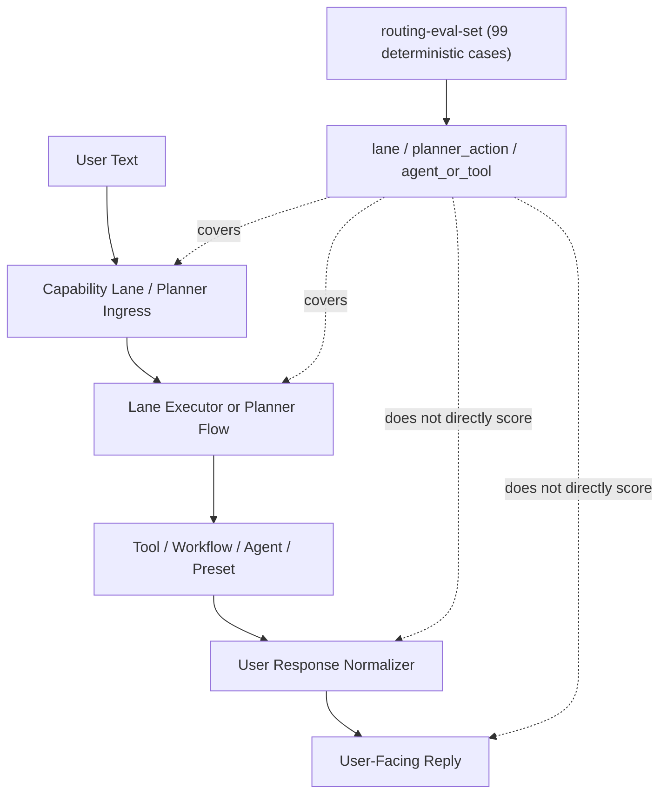
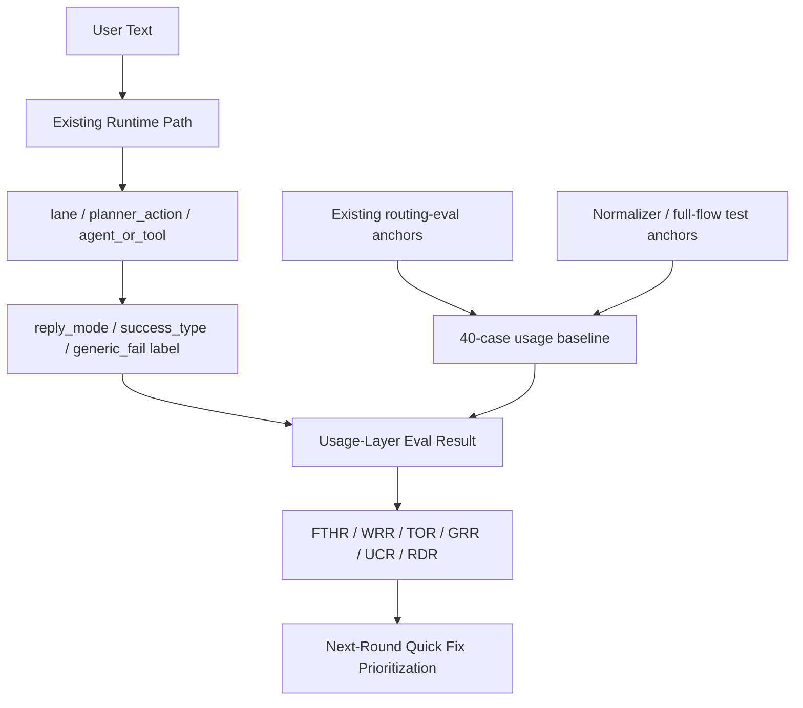

# Usage Layer Health Check PRD

Back to [README.md](/Users/seanhan/Documents/Playground/README.md)

## 背景

這一輪要補的是 usage-layer 的成功標準，不是 runtime 重寫。

目前 repo 已有幾條重要基線：

- `/answer` 與 `knowledge-assistant` 已走 planner-first answer edge，對外回覆固定收斂到 `answer -> sources -> limitations`。
- repo 已有 deterministic routing eval，現況量的是 `lane / planner_action / agent_or_tool` 三層命中。
- executive orchestration、meeting、doc rewrite、cloud-doc workflow 都已有 checked-in runtime，但仍是 bounded、單機、順序式執行。
- planner/skill/runtime 目前沒有 worker mesh、沒有 generic multi-skill runtime、也不是 autonomous company-brain server。

因此目前最大的缺口不是「完全沒有 AI runtime」，而是：

- 我們還沒有一套 usage-layer health check，能回答「第一輪到底有沒有幫到人」。
- 既有 routing eval 能抓錯路由，但抓不到「路由對了、回覆仍然沒幫上忙」。
- 既有測試有零散覆蓋 partial success、fail-soft、workflow gate、answer normalization，但還沒有被收斂成一組可持續追的 usage baseline。

## Repo Reality 與本輪邊界

### Repo Reality

本 PRD 以目前 checked-in code 與 `docs/system` 鏡像為準，關鍵事實如下：

- routing eval 已存在，資料集在 `/Users/seanhan/Documents/Playground/evals/routing-eval-set.mjs`，目前 baseline 覆蓋 99 筆 deterministic case。
- planner runtime 是 bounded execution core，不是 generic multi-agent mesh。
- executive collaboration 目前是 sequential only，不是 parallel worker mesh。
- company-brain 已落地的是 verified mirror ingest、read-side list/detail/search，以及受控 review/conflict/approval 相鄰路徑；不是完整 autonomous runtime。
- `reply_mode=text|card` 已存在於 runtime send path，但那是 transport mode；本 PRD 新增的 `expected_reply_mode` 是 usage-layer semantic mode，只有 `card_preview` 會刻意對應到 transport card。

### 本輪目標

本輪只做兩件事：

1. 把 usage-layer health check 的成功標準正式寫成 PRD。
2. 把 40 條 seed pack 擴成 40~60 條可日常追蹤的 usage eval pack，並定稿 schema 與 case 組成方式。

### 本輪不做

- 不改 planner、lane、agent、workflow、answer normalizer 的 runtime code。
- 不把 placeholder agent runtime 寫成成熟多代理系統。
- 不把 multi-skill mesh、worker mesh、autonomous company-brain 納入本輪範圍。
- 不重寫整套系統。

目前 repo 已有一個 checked-in runner：

- dataset: `/Users/seanhan/Documents/Playground/evals/usage-layer/usage-layer-evals.mjs`
- runner: `/Users/seanhan/Documents/Playground/evals/usage-layer/usage-layer-runner.mjs`
- CLI: `npm run eval:usage-layer`

這個 runner 目前做的是 bounded read-only eval：

- `knowledge_assistant` case 重用既有 route truth，但在 eval runner 內直接驅動 deterministic executor path，再回到同一條 answer boundary，避免 planner JSON latency 把 usage gauge 量成 timeout
- `doc_editor` case 走既有 lane intro / preview boundary，不再被 planner answer edge 吞掉成 generic fallback
- `cloud_doc_workflow` case 走已 checked-in 的本地 preview/review/why reply builder，避免把明顯 workflow case 錯送到 planner answer edge
- personal-lane `partial_success / fail_closed` case 直接重用 checked-in normalizer boundary，不再讓 no-match 類 eval 取決於 planner waiting
- 重用既有 routing resolver 取 `lane / planner_action / agent_or_tool`
- `tool_omission` 判定會優先看是否已命中 checked-in controlled executor；對 `doc_editor` / `meeting_workflow` / `cloud_doc_workflow` 這類非 planner-owner lane，不再把 runner 自己沒走到 owner surface 誤算成 omission
- 用簡單 heuristic 統計 `FTHR / WRR / TOR / GRR / UCR`
- `RDR` 目前先保留 TODO，僅把 reply discipline case log 出來

它不改 routing truth、write policy 或 public response shape；但會在 eval runner 內做 bounded executor fallback，好讓 usage-layer gate 量到的是 answer quality，而不是 planner JSON 生成延遲。

## 問題定義

目前 repo 在 usage layer 的核心問題不是單一「模型不夠強」，而是缺少一套能穩定識別以下三類失敗的共用衡量：

1. 入口理解失敗
   - lane 選錯
   - planner action 選錯
   - 明明是 workflow / doc / runtime 問題，卻掉到 generic fallback

2. 執行策略失敗
   - lane 對了，但沒有走到應該走的 tool / preset / workflow
   - 明明需要 tool 或受控 executor，卻用 generic text 糊過去
   - 應該 partial success 時沒接住，或應該 fail-soft 時卻假裝完成

3. 回覆包裝失敗
   - 回答太 generic，沒有 request-specific nouns、下一步、限制或 evidence
   - workflow reply 沒有把 review/confirm/boundary 講清楚
   - executive / answer path 沒有維持既有的 answer-first brief discipline

換句話說，現況缺的是「user-perceived success」層的 baseline，不是再加一套新的 runtime 名詞。

## 成功標準

### 本輪文件完成標準

本輪在文件層面算完成，需同時滿足：

- 有一份正式 PRD，清楚定義 usage-layer health check 的目標、scope、metric、baseline 組成與 roadmap。
- 有一份 eval schema 文件，能直接拿去 author 40 條 baseline。
- 文件明確說明 repo reality、下一輪實作邊界，以及「這一輪不是重寫系統」。

### 第一輪「有沒有幫到人」的判定標準

這一輪不直接宣稱 runtime 已改善；這一輪定義的是下一輪要量的標準。

下一輪 implementation/quick-fix 完成後，若 40 條 baseline 能穩定回答以下問題，就算 usage-layer 第一輪有幫到人：

- 使用者第一輪是否拿到可用答案、可用 workflow 進展，或可接受的 partial success / fail-soft。
- 當 case 明確需要 tool / workflow / preset 時，系統是否真的走到受控 executor。
- 當 case 不該 generic 時，系統是否仍給出 request-specific reply。
- 當 case 只能 partial success 或 fail-soft 時，系統是否清楚說出已完成部分與限制。

建議把下一輪的初始目標值定為：

| 指標 | 初始目標 |
| --- | --- |
| `FTHR` | `>= 0.75` |
| `WRR` | `<= 0.10` |
| `TOR` | `<= 0.10` |
| `GRR` | `<= 0.15` |
| `UCR` | `<= 0.10` |
| `RDR` | `>= 0.85` |

以上數字是 next-round target，不是當前 repo 已量得的現況。

## 六個使用層指標

| 指標 | 全名 | 主要回答的問題 | 建議公式 |
| --- | --- | --- | --- |
| `FTHR` | First-Turn Help Rate | 第一輪有沒有真的幫到人 | `helpful_cases / total_cases` |
| `WRR` | Wrong-Route Rate | 入口理解有沒有把人送錯 lane / action | `wrong_route_cases / total_cases` |
| `TOR` | Tool Omission Rate | 明明需要受控 executor，卻沒有真的調到 | `tool_required_but_not_reached / tool_required_cases` |
| `GRR` | Generic Reply Rate | 回覆是否落成 generic boilerplate | `generic_fail_cases / generic_sensitive_cases` |
| `UCR` | Unnecessary Clarification Rate | 明明資訊已足夠，卻還是停在 clarify / ask-more | `unnecessary_clarify_cases / clarify_sensitive_cases` |
| `RDR` | Reply Discipline Rate | 回覆是否符合該 lane 應有的包裝紀律 | `reply_mode_match_cases / total_cases` |

### 指標定義補充

#### `FTHR`

這是唯一的總指標。以下任一情況可視為 helpful：

- 直接答案可用
- workflow 有正確推進
- partial success 把可做部分接住
- fail-soft 但明確說出限制與下一步

#### `WRR`

`WRR` 主要看：

- `expected_lane` 是否命中
- `expected_planner_action` 是否命中
- 是否把高置信 doc/runtime/workflow intent 掉到 generic lane

#### `TOR`

`TOR` 不只看 literal tool call，也看受控 executor 是否真的被接上。

在這份 PRD 裡，`tool_required=true` 的 case 若最後沒有抵達對應的：

- `tool:*`
- `workflow:*`
- `preset:*`

都算 omission。

#### `GRR`

下列情況視為 generic risk：

- 回覆幾乎可套用到多個不相干 prompt
- 缺少 request-specific noun、workflow state、下一步或限制
- 用「我可以幫你處理」之類空泛句子取代實際 answer/progress

#### `UCR`

`UCR` 用來防止系統在資訊已足夠時，仍用 clarify 把責任丟回給使用者。

這一輪先把它定成 metric 與 baseline label，下一輪才實作自動判定。

#### `RDR`

`RDR` 檢查回覆有沒有守住該 surface 的既有 discipline，例如：

- answer path 是否維持 `answer -> sources -> limitations`
- executive 是否維持 brief 風格
- workflow reply 是否清楚標示 review/confirm/exit 等下一步
- card preview 是否真的保留為 preview，而不是假裝 apply/completed

## 問題分型

| 分型 | 典型症狀 | 對應指標 |
| --- | --- | --- |
| 入口理解 | lane 選錯、action 選錯、應進 workflow 卻掉到 generic | `WRR`, `FTHR` |
| 執行策略 | 應該調 tool / preset / workflow 卻沒調、partial success 沒接住 | `TOR`, `FTHR`, `UCR` |
| 回覆包裝 | 太 generic、沒有限制、沒有 next step、brief discipline 漏掉 | `GRR`, `RDR`, `FTHR` |

這三類分型不是三套新系統，而是下一輪修 bug / quick-fix 的 triage bucket。

## 50 條 Eval Baseline 設計

### 設計原則

- 50 條不是新產品 contract，而是 usage-layer health pack。
- 優先重用現有 `routing-eval-set`、`full-flow-validation`、`user-response-normalizer` 已有 case family。
- baseline 要能同時量到 route correctness、executor correctness、reply usefulness。
- 每條 baseline 至少要能回答：
  - 有沒有送到對的 lane
  - 有沒有用對的 action / target
  - 回覆模式是不是對的
  - generic reply 在這條 case 上是否應直接判 fail

### 組成比例

| 群組 | 條數 | 主問題 |
| --- | --- | --- |
| `EU` 入口理解 | 14 | lane / action / owner 是否正確 |
| `ES` 執行策略 | 14 | tool / workflow / preset / contextual follow-up 是否正確 |
| `RP` 回覆包裝 | 12 | answer / workflow / partial success / fail-soft 的呈現是否正確 |
| `GX` 實用擴充 | 10 | follow-up、多意圖、command-style、auth/account fail-closed truth |

### 覆蓋範圍

40 條 baseline v1 需至少覆蓋：

- `knowledge_assistant`
- `doc_editor`
- `cloud_doc_workflow`
- `meeting_workflow`
- `registered_agent`
- `executive`
- `personal_assistant`
- `group_shared_assistant`

也需至少涵蓋以下 outcome family：

- direct answer
- workflow progress
- card preview
- partial success
- fail-soft

### 40 條 pack 的定位

這組 50 條 pack 應被視為「usage-layer acceptance pack v1」：

- 小於目前 99 條 routing eval，方便日常快速跑與人工 review
- 比目前 routing eval 多一層 reply-mode 與 success-type
- 比單純 golden answer 更貼近 repo reality，因為它仍以 lane/action/agent_or_tool 為骨架

其中 40 條 seed pack 與 schema 見：

- [usage_layer_eval_schema.md](/Users/seanhan/Documents/Playground/docs/system/usage_layer_eval_schema.md)

目前 checked-in `/Users/seanhan/Documents/Playground/evals/usage-layer/usage-layer-evals.mjs` 會在這 40 條 seed 之上，再補 10 條：

- follow-up / workflow continuation
- multi-intent / partial success
- explicit fail-closed
- command-style 補強

另外，基於目前 repo 沒有 stored explicit user auth / account context 的 code truth，auth-required company-brain read 與 account-required cloud-doc workflow case 在 checked-in pack 中會被標成 `fail_closed`。這不是降格需求，而是避免把環境前置條件缺失誤算成 generic or timeout。

## Execution Graph

### 現況

現況問題是：我們已能觀察 route correctness，但還沒有正式觀察 user-perceived usefulness。

### 方案 B 目標態

方案 B 不是改路徑，而是在既有 runtime 路徑上補一層可衡量的 usage contract。

## 方案比較

| 方案 | 描述 | 優點 | 缺點 | 結論 |
| --- | --- | --- | --- | --- |
| A | 只沿用既有 routing eval | 最省工、完全不碰 reply 層 | 無法回答「對使用者有沒有幫助」 | 不足 |
| B | 在既有 routing eval 骨架上，加上 reply_mode / success_type / generic fail 的 usage-layer baseline | 最符合 repo reality；不需重寫 runtime；能直接支撐下一輪 quick fix | 需要手工定義 40 條 pack 與 judge 規則 | 主推 |
| C | 先重寫 planner/runtime/agent graph，再來談 usage 指標 | 想像空間最大 | 風險最高，且把 measurement 與 rewrite 混在一起；不符合本輪目標 | 不採用 |

主推 B 的原因：

- 它承認 repo 現況已有 planner、workflow、answer boundary，而不是從零開始。
- 它把下一輪工作限制在「可量、可修、可回歸」的範圍。
- 它避免把不存在的 multi-agent mesh、worker mesh、autonomous company-brain 寫成前提。

## 30 / 60 / 90 Roadmap

### 30 天

- 定稿本 PRD 與 eval schema
- 建立 `usage-layer baseline v1` 的 50 條資料檔（由 40 條 seed + 10 條 quality-gate 擴充組成）
- 定義最小 judge 輸出格式：
  - `lane_hit`
  - `planner_hit`
  - `target_hit`
  - `reply_mode_hit`
  - `success_type_hit`
  - `generic_fail`
- 先以人工 review + 小工具跑第一版

### 60 天

- 把 40 條 seed pack 擴成 50 條可日常重跑的 gate pack
- 補上 deterministic comparison 與報表輸出
- 依 metric 分 bucket 做 quick fix：
  - `WRR` 高先修入口理解
  - `TOR` 高先修 executor strategy
  - `GRR/RDR` 高先修 reply boundary
- current third-cut usage fix keeps that same principle for the last `planner_failed` families：
  - `meeting` and `executive` requests prefer bounded owner-aware recovery at the usage layer
  - unsupported `personal reminder` requests stay fail-closed as explicit no-match instead of surfacing raw planner failure

### 90 天

- 把 usage-layer baseline 納入 daily/release 前的 read-only health view
- 視結果把 40 條擴成分層 pack：
  - smoke 版 12 條
  - daily 版 40 條
  - extended 版 80+ 條
- 依 next-round evidence 決定是否再擴到 live shadow sampling 或 telemetry 整合

## 非目標與風險

### 非目標

- 不是要在本輪把 planner、lane、workflow、agent 全部推倒重做。
- 不是要把 placeholder agent runtime 包裝成成熟 specialist team。
- 不是要新增 worker mesh、background queue、parallel handoff engine。
- 不是要把 company-brain mirror/read 路徑描述成正式 autonomous approval runtime。

### 主要風險

| 風險 | 說明 | 緩解方式 |
| --- | --- | --- |
| baseline 過度貼近既有 wording | 40 條 pack 若只複製現有 wording，可能抓不到真實 usage 漂移 | 下一輪 author baseline 時保留既有 anchor，但每群至少加入自然語句變體 |
| generic 判定過於主觀 | `GRR` 容易變成 reviewer feel-based judgement | 在 schema 中固定 `should_fail_if_generic` 與最小判斷規則 |
| reply_mode 與 transport mode 混淆 | `reply_mode=text|card` 與 usage semantic mode 名稱接近 | 文件明確分開兩者，judge 只看 semantic mode |
| 量測目標膨脹成 runtime rewrite | 容易把 measurement thread 變成 architecture rewrite | 以方案 B 為唯一主線，下一輪只允許 quick fix 與 evaluator 接線 |

## 結論

本輪正式目標是先把 usage-layer 成功標準與 eval 建起來。

這份 PRD 的結論是：

- 問題不是缺一套全新系統，而是缺一組能量到「第一輪有沒有幫到人」的 usage baseline。
- 最適合 repo reality 的路線是方案 B：沿用既有 routing / planner / answer boundary，補 usage-layer 40-case eval 與六個 metric。
- 目前已先有 10 條 seed pack 與最小 runner；下一步是擴滿 40 條並把 `RDR` judge 收斂，而不是改 runtime 本體。
