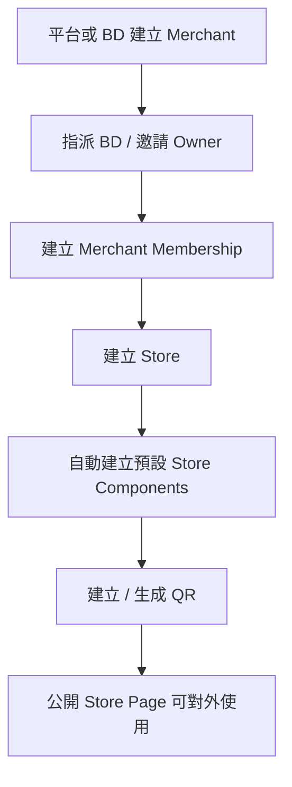
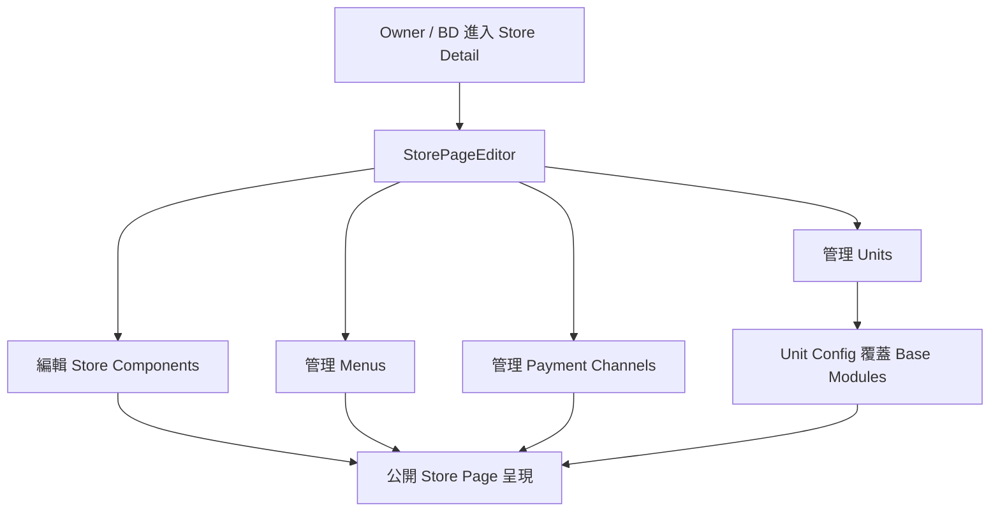
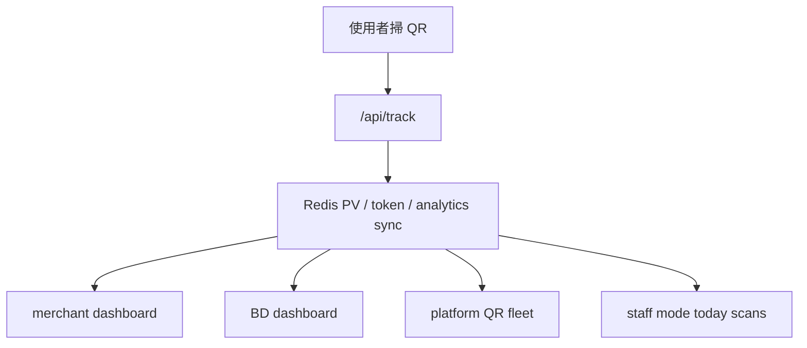

# Scanoo 後台功能地圖

來源專案：`/Users/seanhan/Documents/Playground/.tmp/scanoo-web/scanoo-web拷貝`

這份文件只根據實際程式碼、路由、server actions、元件與 migration 可推斷的內容整理，不假設未看見的功能。

## 1. 產品後台現在實際在做什麼

這不是單純的官網後台，而是一套以 `商家 / 分店 / QR 節點 / 公開店頁 / 人員權限 / 掃碼流量` 為核心的營運控制台。

它目前比較像：

- 平台方管理後台
- BD 落地與商家開通後台
- 商家 owner 的品牌與門店配置後台
- 店長 / 現場人員的輕營運模式
- 對外公開的門店落地頁系統

核心商業物件大致是：

- merchant：品牌 / 商家
- store：分店
- unit：店內點位 / 單元
- qr_code：實體或數位 QR 節點
- merchant_menu：菜單 / 文件資產
- merchant_membership：成員與角色關係
- store_components：公開店頁組件
- tracking / analytics：掃碼與流量資料

## 2. 真實角色模型

從路由、選單、actions 與 role utils 可確認的角色有：

- `super_admin`
- `bd`
- `owner`
- `store_manager`
- `staff`

角色大意：

- `super_admin`
  - 平台總管理
  - 管商家、用戶、平台 QR 艦隊、治理、日誌
- `bd`
  - 負責自己名下商家
  - 可做商家開通、分店建立、部分店頁與 QR 管理
- `owner`
  - 商家主責人
  - 可編輯品牌與分店資料、邀請人員、管理公開頁
- `store_manager`
  - 店層級管理者
  - 主要面向單一店鋪與 staff 管理
- `staff`
  - 現場操作角色
  - 主要進入 staff mode

## 3. 目前實際存在的主要功能區

### 3.1 平台入口與登入

存在：

- 登入
- 註冊
- 註冊成功
- 忘記密碼
- 更新密碼
- auth callback / confirm / error

可推斷：

- 採用 Supabase Auth
- 有 email/password 路徑
- reset password 由後台 action 觸發

### 3.2 平台總覽 Dashboard

存在兩套主要 dashboard：

- `/dashboard`
  - 商家或 owner 視角
- `/admin`
  - super admin 視角
- `/bd`
  - BD 視角

其中真實功能包括：

- 商家上下文判定
- 第一個可用 store 載入
- merchant track stats
- QR 數量統計
- 趨勢圖與點擊圖
- demo mode

可推斷這一塊是目前最成熟的營運可視化區域之一。

### 3.3 商家管理

路由：

- `/merchants`
- `/merchants/new`
- `/merchants/[id]`
- `/merchants/[id]/edit`

實際功能：

- 商家列表
- 搜尋與分頁
- active / deleted 切換
- 建立商家
- 編輯商家
- 商家詳情
- 軟刪除 / 還原 / 永久刪除
- 指派 BD
- 邀請 owner
- 商家條款接受

商家詳情頁目前會聚合：

- 品牌基本資訊
- logo
- 公司 / 統編 / 產業 / 聯絡資訊
- active stores
- deleted stores
- units 預覽
- 條款狀態

這說明 merchant 是系統最核心的上層管理單位。

### 3.4 分店管理

路由：

- `/stores`
- `/stores/[id]`
- `/stores/[id]/edit`
- `/merchants/[id]/new`

實際功能：

- 建立分店
- 編輯分店
- 按 merchant 查全部 stores
- deleted store 支援
- store detail 聚合店頁資料
- store 內 QR 管理入口
- store staff 入口

建立分店後還會：

- 自動建立預設 `store_components`

這代表「公開店頁」不是獨立產品，而是 store 建立流程的一部分。

### 3.5 公開店頁 / 店面展示頁

路由：

- `/(public)/store/[id]`

實際功能：

- 根據 store id 載入店頁
- 支援 `?unit=xxx`
- 查 merchant / store / components / unit
- 載入 payment channels
- 載入 menus
- merchant 未簽條款時顯示 setup 狀態頁

這表示 Scanoo 不只是內部管理後台，還已經有「對外落地頁 / 掃碼承接頁」能力。

### 3.6 店頁編輯器

核心元件：

- `StorePageEditor`
- `MerchantPageBuilder`

實際功能：

- 讀取 `page_components`
- 轉成 builder modules
- 允許 unit layer 覆蓋
- 追蹤 unit 級別變更
- 儲存 unit config
- 管理 payment channels
- 管理 menus
- 支援 WiFi QR 進階選項

這一塊很關鍵，因為它代表產品已經有：

- 模組化頁面編輯
- 門店頁配置
- unit 級別差異化內容

### 3.7 QR Code 管理

平台層：

- `/qrcodes`

店鋪層：

- `/stores/[id]/qrcodes`
- `/stores/[id]/qrcodes/print`

實際功能可確認：

- 取店鋪 QR 列表
- 取最新 QR
- 取指定 QR
- 刪除 QR
- 區分一般 QR 與 WiFi QR
- QR 列印頁
- QR print sheet
- WiFi QR dialog
- 平台 QR fleet monitor

平台 QR 頁目前真實資料來源是：

- merchants 表
- qr_codes 關聯
- Redis PV keys

但「異常數量」目前是硬設 `0`，表示平台 QR 艦隊監控有真資料骨架，但異常治理還沒完全接起來。

### 3.8 Unit / 點位管理

從 actions 與編輯器可確認：

- 建立 unit
- 批量建立 unit
- 更新 unit
- 更新 unit config
- 刪除 unit
- 批量刪除 unit
- 啟用 / 停用 unit
- 依 store 查 units
- 依編號查 unit

這說明系統不是只有品牌與分店兩層，還有「店內細粒度點位」概念。

這對後續產品迭代很重要，因為代表你們可以做：

- 店內不同桌位 / 區位 / 場景入口
- 不同 QR 對應不同內容或設定

### 3.9 商家菜單 / 素材管理

可確認存在：

- `merchant_menus`
- `merchant-menu-uploader`
- 公開頁會讀 menus 並排序

可推斷：

- 菜單 / PDF / 圖片資產是公開頁內容的一部分
- 菜單已和 merchant 綁定，不只是店層級

### 3.10 成員、邀請、權限

存在：

- 平台 users 管理
- owner 邀請
- staff / store_manager 邀請
- pending invitations
- resend password reset
- 更新 member email
- remove staff
- membership manager
- member actions

權限規則可確認為：

- `super_admin` 可以全平台管控
- `bd` 只能碰自己負責 merchant
- `owner` 可以管理自己 merchant
- `store_manager` 權限較收斂，對 staff 有部分管理能力

這一塊其實已經是「B2B SaaS 多角色權限模型」的初版。

### 3.11 Staff Mode

路由：

- `/staff-mode`
- `/stores/[id]/staff`

實際功能：

- 顯示 store online/offline
- 顯示今日 scans
- 顯示 digital QR support
- 顯示 feature grid
- 顯示 node status

重要判斷：

- 這塊目前不是純 mock
- `getStaffModeData()` 會查真實 store / qr / Redis PV

但仍有未完成處：

- 現場支援 / 疑難排解 / 異常回報區塊明確標了 TODO

### 3.12 Governance / Logs

路由：

- `/governance`
- `/logs`

這兩塊目前介面存在，但資料層狀態不同：

- `GovernancePanel`
  - 目前是高擬真 mock issue list
  - 有搜尋、篩選、抽屜、severity、activity logs
  - 但不是接真實治理表
- `ActivityLogTable`
  - 目前也是 mock logs
  - 有搜尋、篩選、展開明細、桌機表格
  - 但不是接真實 audit log source

所以：

- 產品方向存在
- UI 方向也很明確
- 但治理與審計目前還不算真上線能力

### 3.13 Platform Fleet / 平台級監控

存在於：

- `PlatformQRManager`
- `getFleetData()`

這一塊已可做：

- 看所有 merchant QR 節點數
- 看今天掃描量
- 看健康分數
- 看 critical count
- 看 merchant 級風險狀態
- 搜尋與篩選 merchant fleet

但現階段仍偏：

- 流量 / 健康度運營面板
- 尚未完整接治理異常事件閉環

### 3.14 Account / 基本帳號維護

存在：

- account page
- profile form
- password form

代表每位後台使用者都有基本帳戶設定能力。

## 4. 主要資料流

### 4.1 商家開通流

### 4.2 門店頁運營流

### 4.3 掃碼與分析流

## 5. 哪些能力是真的，哪些是半成品

### 5.1 已經是真功能骨架

- 認證與登入
- 多角色權限
- merchant CRUD
- store CRUD
- soft delete / restore
- owner / staff / store_manager 邀請
- 公開店頁
- page builder / store component 配置
- menus 綁定
- QR 管理
- unit 管理
- dashboard / BD dashboard / admin dashboard
- 掃碼資料進 Redis / analytics 流

### 5.2 已有產品方向但尚未完全落地

- governance 中台
- 平台級 activity logs
- 異常檢測閉環
- field support / 現場支援
- 更完整的 fleet anomaly intelligence

### 5.3 目前是高擬真展示，不應誤判成已上線能力

- `GovernancePanel` 的 issue 資料
- `ActivityLogTable` 的 log 資料

## 6. 功能成熟度判斷

如果從「對下一步產品迭代的可用理解」來看，這個後台目前最成熟的其實不是治理，而是下面三條主線：

- 商家 / 分店 / 角色開通與管理
- 門店公開頁配置與 QR 入口運營
- 掃碼後的基礎分析與營運監控

也就是說，現在產品的真實核心不是「AI 後台」或「審計中台」，而是：

- 線下入口數位化
- 品牌 / 分店 / 點位的 SaaS 管理
- QR 帶動的流量承接與營運

## 7. 對你們接下來產品迭代最重要的理解

### 7.1 這個產品其實已經有三層結構

- 平台層：管理商家、用戶、艦隊、治理
- 商家層：管理品牌、分店、公開頁、菜單、成員
- 現場層：staff mode、數位碼、節點狀態

下一步迭代如果不分層，很容易把產品做亂。

### 7.2 真正差距不在 CRUD，而在「閉環」

現在 CRUD、頁面編輯、QR、權限已不少。  
真正還沒閉環的是：

- 治理發現異常之後怎麼處理
- log 如何成為真審計能力
- staff 現場問題如何回報與追蹤
- 平台異常如何流回 BD / owner / store_manager

### 7.3 已經有很好的產品延展點

從現有模型看，後續很適合延展：

- 店內 unit 的精細化營運
- 不同 QR 的不同目標頁與目標行為
- 商家 / 分店開通流程標準化
- 平台健康度 / 異常治理中台
- BD 落地任務系統
- 店頁內容模組化模板

## 8. 我對目前後台的總結

一句話總結：

這是一個以 `商家開通 + 分店運營 + QR 入口 + 公開頁配置 + 多角色協作` 為主體的 B2B 營運後台，核心結構已經存在，真正還沒完成的是治理閉環、審計真實化與更強的現場運營支援。

如果要用更產品化的方式講，現在它已經不是「網站後台」，而是：

`Scanoo 線下入口營運系統` 的第一版中台。

## 9. 下一步最值得做的理解輸出

如果要進一步支援產品迭代，下一份最值得做的不是再看程式碼，而是把這份功能地圖往下拆成：

- 現有功能樹
- 真正使用者角色旅程
- 哪些功能已上線、哪些是假資料
- 下一版產品優先級建議

這樣你們就能直接拿來排 roadmap。
